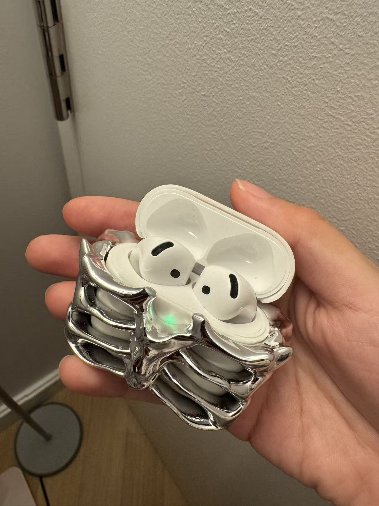

My daily tool is AirPods. I first started using wireless earbuds back in 2017. I wear them to listen to music, block out noise in busy environments, and keep my audio from disturbing people around me. Compared with wired headphones, they bring great convenience, especially during activities that require large body movements, like exercising or cooking. Wired earphones get in the way of movement, and their cables always get tangled when stored. If wireless earbuds did not exist, I would go back to wired headphones.

I tried many other wireless earbud brands before switching to AirPods, including Huawei and Skullcandy, and I also used over-ear headphones for a period. I only moved to AirPods after I switched to an iPhone. I am impressed by how seamlessly Apple connects its whole ecosystem of devices; it is a remarkably effective product strategy that keeps users locked within its system. Even with the convenience, I still notice small downsides, such as battery life limits, which wired headphones never have.